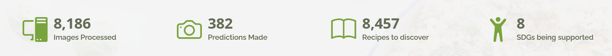
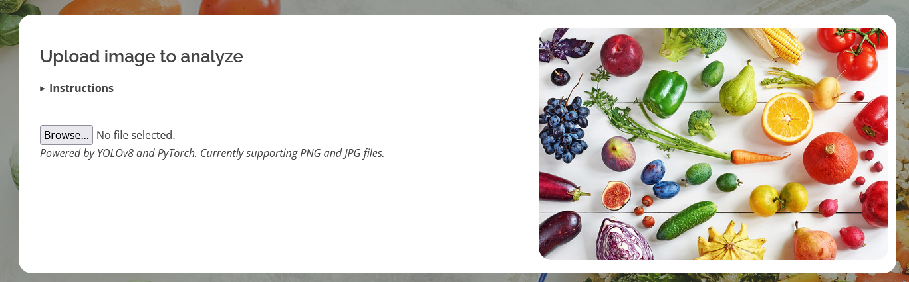
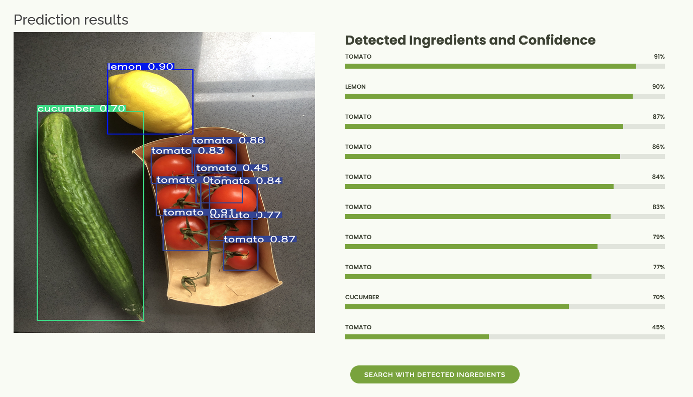
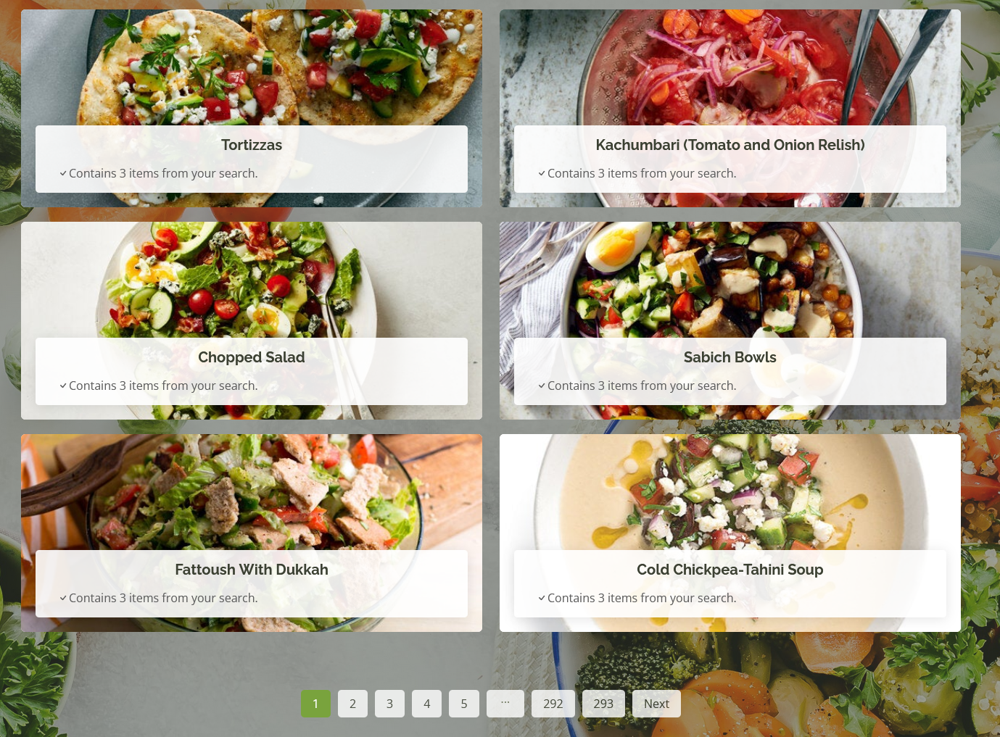

# TasteScape Project

TasteScape provides recipes based on a picture of leftover vegetables and fruits. Hereby the project aims to reduce food waste, and thus benefits SDG 12: Responsible Consumption and Production.

The front-end is a web-application made in Flask with a SQLite database.

## Recipes and image detection

The search function can be used to search for any type of ingredient and is not restricted to just vegetables. The database contains over 8,000 recipes.

The YOLOv8 image detection model accepts both PNG and JPG file formats. The model has been trained on 41 unique classes of fruits and vegetables, over 8,000 images in total.

## Demo
A JPG or PNG image can be uploaded to the model.

After uploading an image, prediction results are presented, with accuracy per class.

When the predictions are made, the application can take you to the search page where it recommends recipes based on these ingredients.

